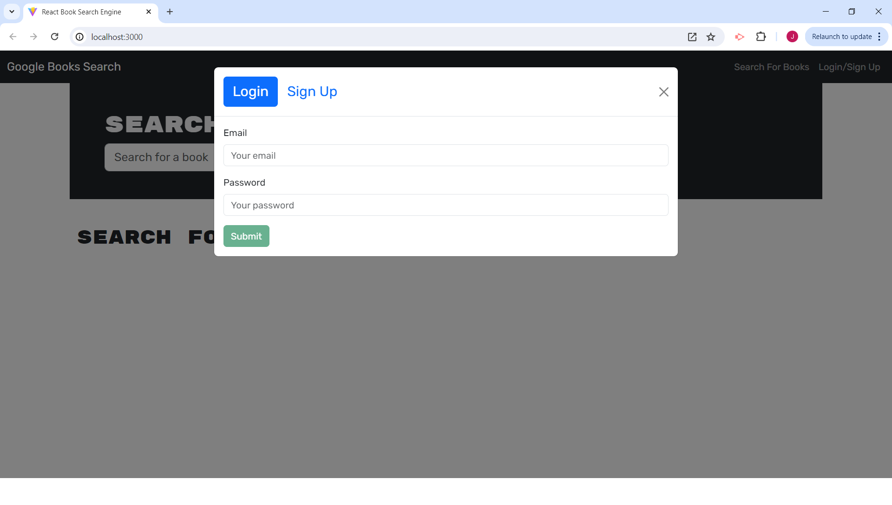
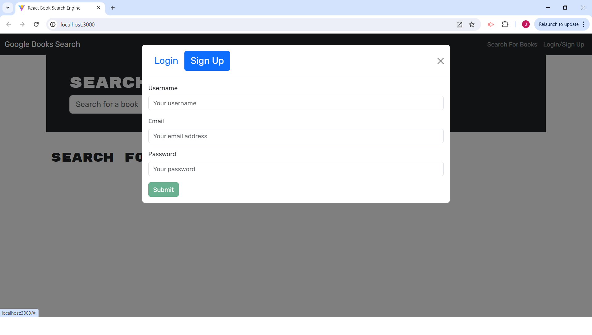
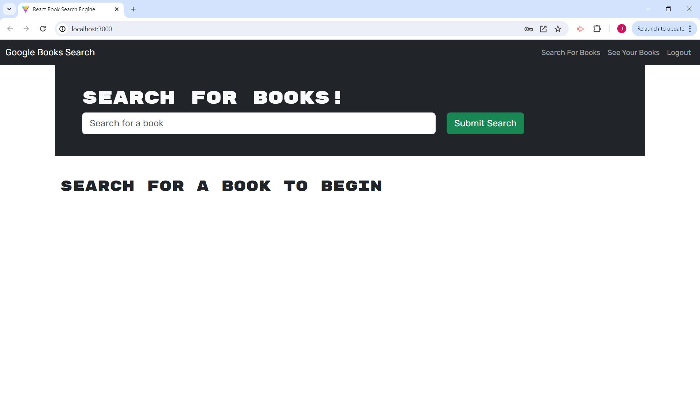
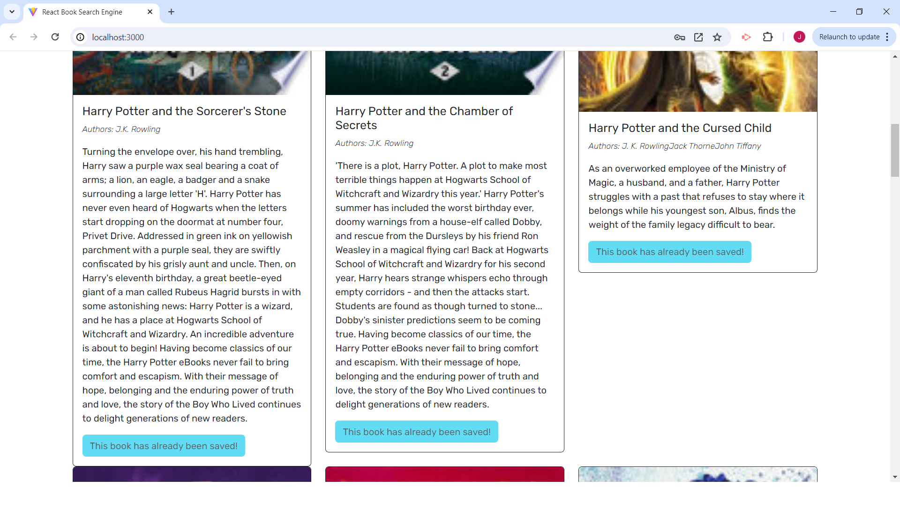
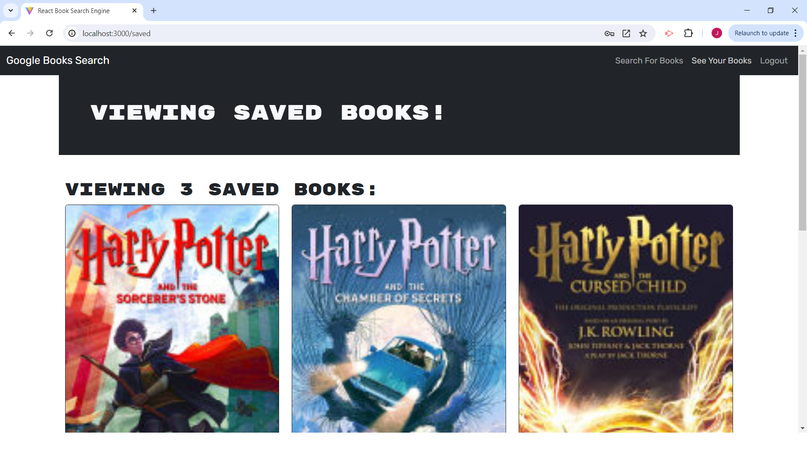
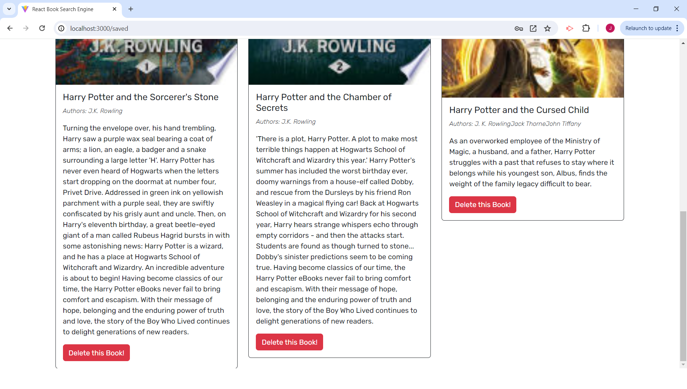

# Google Book Search Engine

## Description

This is a Google Books API search engine that has been refactored using GraphQL and Apollo Server. It allows users to create an account, search for books, and save books to local storage.

## Table of Contents (Optional)

- [Installation](#installation)
- [Usage](#usage)
- [Credits](#credits)
- [License](#license)

## Installation

Visit: https://book-search-engine-duct.onrender.com/

## Usage

Upon visiting the site, users are greeted with the homepage. The homepage gives the option to search books or to signup/login. 

After signing up or logging in, users can still search for books, however, they now have the ability to save books.

When selecting "See Your Books", users are sent to a page that shows all saved books. Users also have to option to delete saved books.

## Credits

Apollo Docs helped with getting the apollo server and middleware set up. They were also used for handling arguments, queries, and mutation.
https://www.apollographql.com/docs/apollo-server/getting-started
https://www.apollographql.com/docs/apollo-server/integrations/building-integrations
https://www.apollographql.com/docs/apollo-server/data/resolvers#handling-arguments
https://www.apollographql.com/docs/react/data/mutations/#refetching-queries

## License

MIT License

Copyright (c) 2024 jinkc21

Permission is hereby granted, free of charge, to any person obtaining a copy
of this software and associated documentation files (the "Software"), to deal
in the Software without restriction, including without limitation the rights
to use, copy, modify, merge, publish, distribute, sublicense, and/or sell
copies of the Software, and to permit persons to whom the Software is
furnished to do so, subject to the following conditions:

The above copyright notice and this permission notice shall be included in all
copies or substantial portions of the Software.

THE SOFTWARE IS PROVIDED "AS IS", WITHOUT WARRANTY OF ANY KIND, EXPRESS OR
IMPLIED, INCLUDING BUT NOT LIMITED TO THE WARRANTIES OF MERCHANTABILITY,
FITNESS FOR A PARTICULAR PURPOSE AND NONINFRINGEMENT. IN NO EVENT SHALL THE
AUTHORS OR COPYRIGHT HOLDERS BE LIABLE FOR ANY CLAIM, DAMAGES OR OTHER
LIABILITY, WHETHER IN AN ACTION OF CONTRACT, TORT OR OTHERWISE, ARISING FROM,
OUT OF OR IN CONNECTION WITH THE SOFTWARE OR THE USE OR OTHER DEALINGS IN THE
SOFTWARE.

---